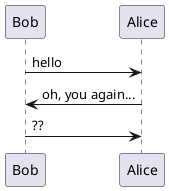
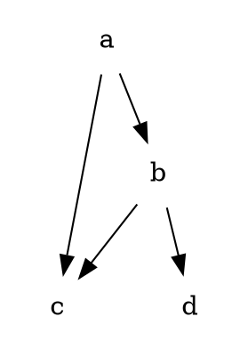

# markdeck

create sleek slide decks using markdown only

| [github.com/arnehilmann/markdeck](https://github.com/arnehilmann/markdeck)

| [markdeck on docker hub](https://hub.docker.com/r/arne/markdeck/)

<small> arne@hilmann.de | 2017-11 </small>


# features

the whole deck in one markdown file

on-the-fly rendering of asciiart<br> (ditaa, plantuml, graphviz)

sleek ui, based on reveal.js

on-the-fly reload when changing sources


# plantuml {bg=lightblue}




# ditaa {bg=sandybrown}

```ditaa
    +--------+   +-------+    +-------+
    |        +---+ ditaa +--->|       |
    |  Text  |   +-------+    |diagram|
    |Document|   |!magic!|    |       |
    |     {d}|   |       |    |       |
    +---+----+   +-------+    +-------+
        :                          ^
        |       Lots of work       |
        +--------------------------+
```

# graphviz {bg=green}




# asciinema {bg=black}

<asciinema-player
    src="./assets/img/test.json"
    poster="npt:0:21"
    idle-time-limit=1
    speed=2
    rows=18
    font-size="medium"
></asciinema-player>


# Thank You!

| [pandoc](http://pandoc.org)

| [reveal.js](http://lab.hakim.se/reveal-js/#/)

| [plantuml](http://plantuml.com)

| [ditaamini](https://github.com/pepijnve/ditaa.git)

| [graphviz](http://www.graphviz.org)

| [asciinema](https://github.com/asciinema/asciinema-player)

| [decktape](https://github.com/astefanutti/decktape)


# markdeck @ github

```qr
https://github.com/arnehilmann/markdeck
```


<script src="assets/3rdparty/asciinema-player.js"></script>
