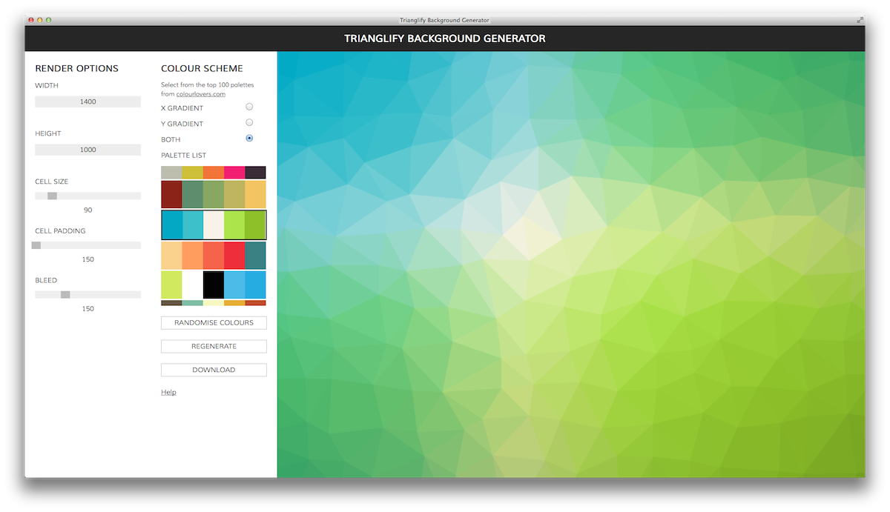

# Trianglify Background Generator

A tool to generate images from SVGs rendered by the [Trianglify](https://github.com/qrohlf/trianglify) JS plugin.

The app utilises the [ColourLovers](http:colourlovers.com) API to allow backgrounds to be generated using colours from the top 100
palettes.

See the app in action [here](http://alssndro.github.io/trianglify-background-generator/).

## Issues

There are some compatibility issues regarding conversion of SVGs to images in-browser. At the moment
the Download feature does not work in Safari.

For the moment I have also omitted the 'noise' slider since converting medium/large resolution SVGs (with noise) to PNG kept crashing the Chrome tab. 

From browsing around other repos using the trianglify plugin, this seems to be a common issue. I should note that this isn't the fault of the plugin itself, but the implementation of the canvas element which seems to struggle with noise.
